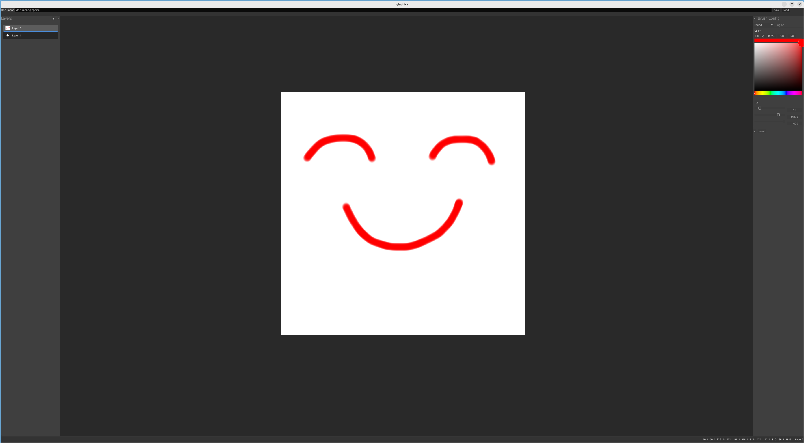

# Glaphica

Glaphica is an experimental digital painting tool built with Rust and wgpu.

The project currently focuses on a GPU-centered painting architecture. It explores workflows in which image data and stroke processing remain on the GPU as much as possible, rather than using a CPU-first raster pipeline.

Brushes are treated as configurable rendering pipelines, so the project can be used to test brush behavior and related shader-based rendering experiments.

The long-term direction is cross-platform support through Rust and wgpu, with possible web or PWA deployment if the surrounding platform capabilities become practical.



The current codebase is sufficient to show the main technical direction, while many workflows and user-facing details are still evolving.

## Current status

Glaphica is currently in an early stage. The repository should be understood as an active implementation of the painting engine and surrounding application structure, rather than a feature-complete painting program.

### What already exists

- runnable desktop application prototype
- Rust workspace split into multiple focused crates
- document and layer model
- built-in brush registration and switching
- basic undo/redo support
- brush configuration UI
- layer selection, creation, grouping, and movement
- document save/load
- screenshot and trace-related utilities

### What is still in progress

- overall UX polish
- shortcut system and workflow refinement
- more painting tools and brush types
- file format stability
- packaging and installer support
- wider platform validation

## Quick start

Clone the repository and run the application with Cargo:

```bash
git clone https://github.com/SunastanS/glaphica
cd glaphica
cargo run -p glaphica
```

For development builds, you will need a working Rust toolchain and a graphics environment supported by `wgpu`.

## Repository layout

```text
.
└── crates/
    ├── glaphica        # desktop app entry
    ├── app             # app-thread integration and high-level runtime glue
    ├── document        # document and layer model
    ├── brushes         # built-in brush implementations and config
    ├── gpu_runtime     # GPU runtime / surface handling
    ├── thread_protocol # cross-thread protocol and transport types
    ├── threads         # thread model
    ├── glaphica_core   # shared core types
    ├── atlas           # atlas-related infrastructure
    └── images          # image layout and related utilities
```

## Project goals

The current phase of the project focuses on:

- keeping the document model explicit and extensible
- keeping painting and rendering systems modular
- supporting experiments with brushes, layers, and GPU-driven workflows
- moving toward a more usable painting workflow while the architecture is still evolving

## Roadmap

Near-term priorities include:

- improving testing and release engineering
- expanding brush and tool support
- refining the UI structure
- stabilizing document handling

## Contributing

Issues, discussions, and early feedback are welcome, especially around:

- rendering architecture
- document and layer design
- brush behavior
- input handling
- workspace / crate organization

## License

This project is licensed under the MIT License. See the `LICENSE` file for details.
